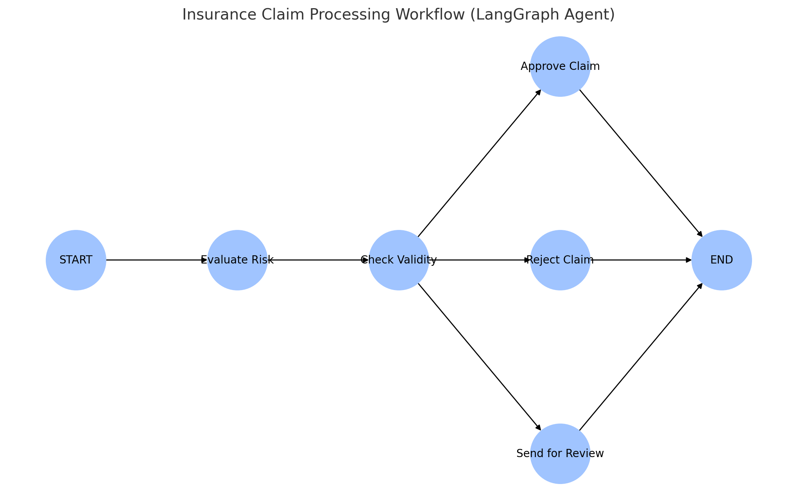

# AI Insurance Claims Processing Agent


## 🔄 About LangGraph
LangGraph is a sophisticated library built on top of LangChain that enables the creation of stateful, multi-agent workflows. It provides:
- **Directed Graph Architecture**: Enables complex decision flows and agent interactions
- **State Management**: Maintains context throughout the processing pipeline
- **Agent Orchestration**: Coordinates multiple AI agents working together
- **Conditional Routing**: Allows dynamic workflow paths based on agent outputs
- **Integration with LangChain**: Seamlessly works with LangChain's components and models

In this project, LangGraph orchestrates the flow between different processing stages:
- Risk assessment agent
- Validity checking agent
- Decision routing logic

## 🤖 Overview
An intelligent insurance claims processing system built with LangGraph and OpenAI that automates claim evaluation through a  multi-agent workflow.





## ✨ Key Features
- 🔄 Graph-based workflow orchestration with LangGraph
- 🧠 AI-powered risk assessment using OpenAI GPT
- 📝 Automated claim validity verification
- 💾 Historical claim comparison using ChromaDB
- 🌐 Interactive web interface with Streamlit

## 🛠️ Installation

### Prerequisites
- Python 3.9+
- OpenAI API key

### Setup Steps

1. **Clone the repository**
```bash
git clone https://github.com/sap156/AI-Claims-Agent-LangGraph.git
cd AI-Claims-Agent-LangGraph
```

2. **Set up virtual environment**
```bash
python -m venv venv
source venv/bin/activate  # For Mac
```

3. **Install dependencies**
```bash
pip install -r requirements.txt
```

4. **Configure OpenAI API Key**
Create `.streamlit/secrets.toml`:
```toml
OPENAI_API_KEY = "your-api-key-here"
```

## 🚀 Running the Application

1. **Start the app**
```bash
streamlit run app.py
```

2. **Access the interface**
- Open browser to `http://localhost:8501`
- Enter claim details
- Click "Evaluate Claim"

## 📋 Example Claim Format
```
Claim Type: Auto Insurance
Date: 2024-05-01
Description: Minor fender bender in parking lot
Amount: $2,500
Supporting Details: Police report #12345
```

## 🏗️ Project Structure
```
AI-Claims-Agent-LangGraph/
├── app.py              # Main application
├── requirements.txt    # Dependencies
├── README.md          # Documentation
├── .streamlit/        # Streamlit config
│   └── secrets.toml   # API keys
└── chroma_store/      # Vector database
```

## 🔄 Workflow Process

1. **Risk Evaluation (0-10 scale)**
   - Low Risk (<3): Automatic approval
   - Medium Risk (3-7): Manual review
   - High Risk (>7): Automatic rejection

2. **Validity Check**
   - Completeness verification
   - Required information check

3. **Decision Making**
   - Automated routing based on risk/validity
   - Historical comparison
   - Final determination

## 🤝 Contributing
Contributions welcome! Please:
1. Fork the repository
2. Create a feature branch
3. Submit a Pull Request


## 🔗 Dependencies
- LangGraph
- LangChain
- OpenAI
- Streamlit
- ChromaDB
- Python 3.9+
